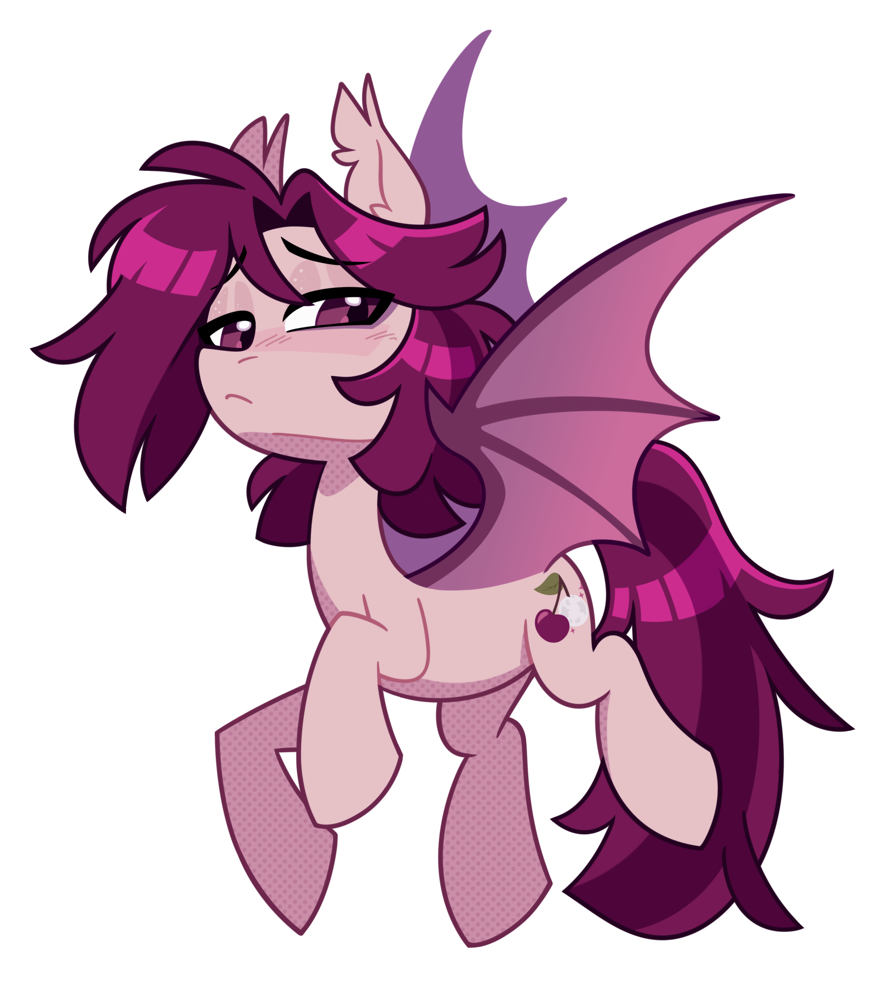

  <h1>⟡ WELCOME TO MY PAGE ⟡</h1>
  <b>Pony/Furry Artist | 24 | Freelancer</b>
  
For commission information and art examples ⟶ <a href=https://crimmharmony.carrd.co/ target="_blank" rel="noopener noreferrer">Click Here!</a>
  

  
It was brought to my attention recently that there's a niche amount of Pony Town players who have GitHub accounts attached to their pony avatars in-game with general information about their interests and links to other social media in their bios. I would have never thought to do something like this as a roundabout way to create a "profile" for fellow players to see. Now that I know it exists? I'm going to have some fun with it!

   

<h2>
⟡ The Drawspace ⟡
</h2>

The Drawspace is a Multiboard Magma Canvas created by CrimmHarmony as a fun way to engage with other Pony Town players. If you're the artsy type feel free to stop by and draw. Talk with other artists and chat with your friends on Pony Town!

Only interested in being a spectator? Check out the Projects tab for all the latest Issues and Sketch Page dumps!

<b>‼️PLEASE BE RESPECTFUL | KEEP THE CANVAS SFW | FAILURE TO REMAIN CIVIL WILL RESULT IN A BLOCK ‼️</b>  

Enter The Drawspace! ⟶ <a href=https://magma.com/d/nDpxL8qJWY>Join Here</a>
  

  ⟡ Thanks for visiting my profile! Have a nice day! ⟡  
  &copy; 2025 CrimmHarmony

